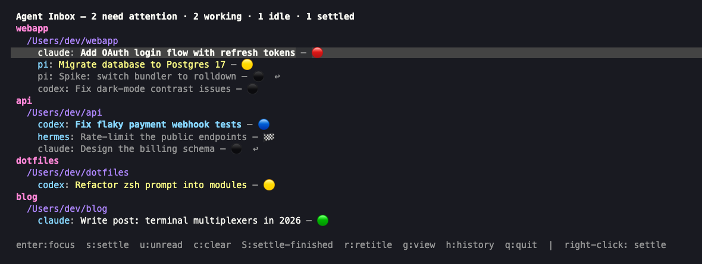
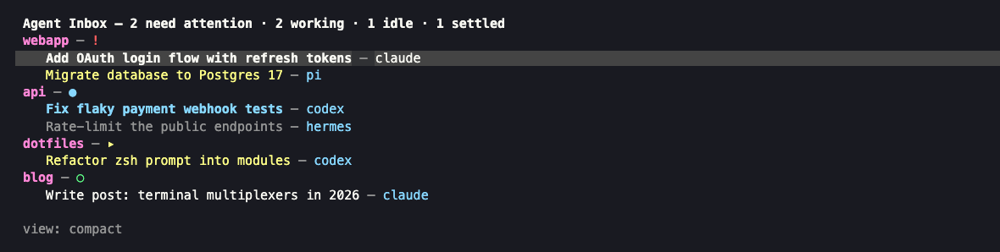
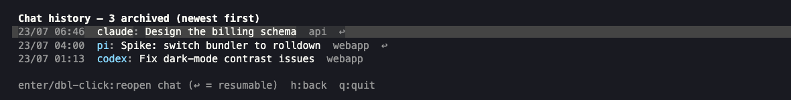

# herdr-agent-inbox

**An actual inbox for your coding agents.** Live agents stay in the Agents
pane; archived and snoozed agents disappear but remain searchable and
resumable. Also includes session titles, running times, and workspace rollups for
[herdr](https://herdr.dev).



## What you get

- **Session titles** — every agent pane gets a real title derived from its
  conversation ("Fix flaky payment webhook tests"), not just `claude` or a
  directory name. Reads the agent's native transcript (claude / pi / codex),
  optionally summarized by any LLM command you configure.
- **Safe archive** — `e` durably records a verifiably resumable idle/done
  session, rechecks that it did not become active, then closes its exact pane.
  Working, blocked, unknown, or transcript-less agents are refused.
- **Snooze** — `s` accepts one Todoist-like line such as
  `3h ask cat when back` or `1-oct tickets should be available`. The leading
  duration/date is mandatory; the rest is an optional human-only reminder.
  The exact session safely closes, wakes in the background without stealing
  focus, and returns to Agents unread. Date-only snoozes wake at 09:00 local.
- **Search and revive** — `h` opens unified history with Snoozed stacked above
  Archived. `/` searches title, reminder,
  workspace, path, agent, and session ID, and Enter revives the session.
  A session already live is focused instead of duplicated.
- **Running times** — how long each session has lived and how long it's been
  in its current state, live in the sidebar.
- **Workspace rollups** — each workspace row shows its agents by state
  (`!1 ●2 ▸1 ○3`) plus the longest-running busy stint.
- **Sidebar resize** — grow/shrink herdr's sidebar from the keyboard (and
  keep herdr's native mouse-drag working).

Everything runs through herdr's public plugin surface — no fork, no patches,
stdlib Python only.

## The popup

`prefix+i` opens the inbox. `g` rotates four views, `h` opens history.
The thread you invoked it from is selected automatically.

**Compact** — one line per chat, workspace headers with a dominant-state flag:



**History** — snoozed chats first, then every archived chat; `↩` means resumable:



| Key | Action |
|---|---|
| `enter` / double-click | Focus the agent (or reopen archived/snoozed chat) |
| `e` / right-click | Archive an idle/done agent |
| `s` | Snooze an idle/done agent (`15m`, `3h`, `5d`, `1-oct`, optional reminder) |
| `u` | Mark a live agent unread |
| `h` | Snoozed + Archived history / back |
| `/` | Search history |
| `r` | Regenerate the title |
| `g` | Rotate view: tree → compact → grouped → flat |
| `q` / esc | Close |

### State legend

`🔴` / `!` blocked · `🔵` / `●` finished, unseen · `🟡` / `▸` working ·
`🟢` / `○` idle · `⏰` snoozed · `⚫` archived chat — matching herdr's
own sidebar color language (red/teal/yellow/green), in your herdr theme's
exact palette.

## Install

Requires herdr ≥ 0.7.0 and `python3` (3.11+ recommended) on PATH.

```sh
herdr plugin install Piste/herdr-agent-inbox
```

The daemon starts with your session (and a watchdog revives it). Then wire up
the display and keys:

### Sidebar rows (`~/.config/herdr/config.toml`)

The plugin reports tokens; your sidebar config decides what renders:

```toml
[ui.sidebar.agents]
rows = [
  ["state_icon", "$title"],
  [{ token = "$reminder", bold = true }, { token = "$flag", fg = "#f1fa8c", bold = true }, "agent", "workspace", { token = "$age", dim = true }],
]

[ui.sidebar.spaces]
rows = [
  ["state_icon", "workspace", "$agents", { token = "$busy", dim = true }],
  ["branch", "git_status"],
]
```

Available pane tokens: `$title`, `$age` (session running time), `$since`
(time in current state), `$flag` (● finished-unseen), and `$reminder` (a
woken snooze's human reminder, cleared when focused). Workspace tokens:
`$agents` (state counts), `$busy` (longest working stint). Styled custom
tokens keep the `$` prefix; builtins stay bare.

### Keybindings

```toml
[[keys.command]]
key = "prefix+e"
type = "shell"
description = "archive focused idle/done agent"
command = "herdr plugin action invoke archive --plugin herdr-agent-inbox"

[[keys.command]]
key = "prefix+i"
type = "shell"
description = "open agent inbox popup"
command = "herdr plugin pane open --plugin herdr-agent-inbox --entrypoint inbox"

[[keys.command]]
key = "prefix+alt+right"
type = "shell"
description = "sidebar wider (+2 cols)"
command = "herdr plugin action invoke sidebar-grow --plugin herdr-agent-inbox"

[[keys.command]]
key = "prefix+alt+left"
type = "shell"
description = "sidebar narrower (-2 cols)"
command = "herdr plugin action invoke sidebar-shrink --plugin herdr-agent-inbox"
```

Then `herdr server reload-config`.

## Title configuration

`<herdr config dir>/plugins/config/herdr-agent-inbox/config.toml`
(auto-created with comments on first run, hot-reloaded on change):

```toml
[title]
source = "first"   # "first" opening prompt | "last" most recent prompt
summarize = false  # pipe the prompt through summarize_cmd for a real title
summarize_cmd = "claude -p --model claude-haiku-4-5-20251001 'Write a 4-8 word title for this coding-agent session request. Output ONLY the title, nothing else.'"
summarize_timeout_secs = 60
```

### Auto-renaming tabs

```toml
[tab]
rename_from_agent_title = true   # tab label follows the agent's session title
max_chars = 24                   # truncate, appending `ellipsis`
ellipsis = "…"
respect_manual = true            # never overwrite a label you typed
```

A tab is managed only while its label is herdr's default (the tab number) or
the exact label the plugin last set — rename a tab yourself and the plugin
leaves it alone forever after; reset it to the number to hand control back.
When a tab holds several agents, the most attention-worthy one names it
(blocked → unseen → working → idle, most recent first).

`source = "last"` re-derives the title whenever the agent finishes a turn.
Summaries run on an async worker, cached per prompt content (one call per
session), falling back to the truncated raw prompt until they land. Agents
without transcript refs (e.g. hermes) fall back to their pane/terminal title
— which you can override anytime: the inbox's `r` regenerates, and the
`set-title` control command pins a title of your choosing.

**Privacy note:** titles are derived from your prompts, and snooze reminders
are the text you type. Both are stored locally in the private plugin state
directory and may be rendered in your sidebar/Herdr notifications. If you enable
`summarize`, prompt excerpts are piped to *whatever command you configure* —
nothing leaves your machine unless that command sends it somewhere.

## Sidebar resize

Herdr's effective sidebar width is session state clamped by
`sidebar_min_width`/`sidebar_max_width` (and herdr natively supports dragging
the sidebar's last column with the mouse). The `sidebar-grow`/`sidebar-shrink`
actions force an exact width by pinning the clamps and immediately relaxing
them back to `[20, 60]`, so keyboard and mouse resize coexist. Absolute width:
`python3 actions.py sidebar 36`.

## How it works

- **`daemon.py`** — a stdlib-Python daemon started by the plugin's
  `[[startup]]` hook. Subscribes to herdr socket events, diffs `agent.list`,
  derives titles from native transcripts, and reports pane/workspace metadata
  plus an `agent.view.set` inbox sort. Archives append and fsync to
  `history.jsonl`; snoozes atomically fsync their wake queue before the pane is
  closed. A control socket serves the actions/TUI.
- **`actions.py`** — the keybindable actions (archive, unread, retitle, set-title,
  sidebar resize, restart-daemon).
- **`inbox_tui.py`** — the popup (`[[panes]]`, placement popup) with the four
  views, mouse support, theme-matched colors, and unified history browser.
  Try it standalone with `python3 inbox_tui.py --demo`.
- **`restore.py`** — exact-session revival shared by the popup and snooze
  scheduler, with explicit focus for manual revives and no focus for alarms.

State lives next to your herdr session socket in `agent-inbox-state/`
(`state.json`, `history.jsonl`, `snoozes.json`, `daemon.log`, control socket).

## License

[MIT](LICENSE)
